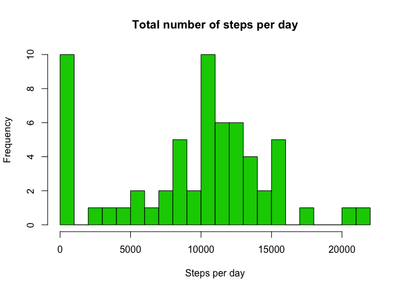
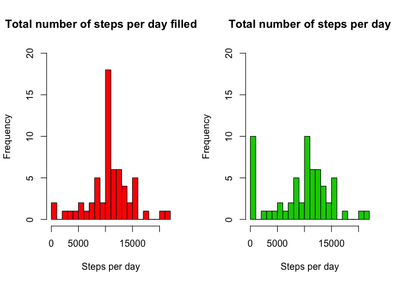
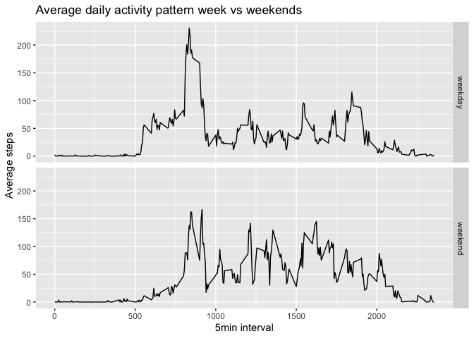

## Assignment

This assignment aims to introduce the process of reproducible research using Rmarkdown and the repository github. It is based on a dataset called "activity". A bunch of data analyses are requested and a report including the codes and the output must be proposed.Here are the general requests:

"This assignment will be described in multiple parts. You will need to write a report that answers the questions detailed below. Ultimately, you will need to complete the entire assignment in a single R markdown document that can be processed by knitr and be transformed into an HTML file.

Throughout your report make sure you always include the code that you used to generate the output you present. When writing code chunks in the R markdown document, always use echo = TRUE so that someone else will be able to read the code. This assignment will be evaluated via peer assessment so it is essential that your peer evaluators be able to review the code for your analysis.

For the plotting aspects of this assignment, feel free to use any plotting system in R (i.e., base, lattice, ggplot2)

Fork/clone the GitHub repository created for this assignment. You will submit this assignment by pushing your completed files into your forked repository on GitHub. The assignment submission will consist of the URL to your GitHub repository and the SHA-1 commit ID for your repository state.

NOTE: The GitHub repository also contains the dataset for the assignment so you do not have to download the data separately."

## Loading and preprocessing the data

Show any code that is needed to

1. Load the data (i.e. read.csv())

2. Process/transform the data (if necessary) into a format suitable for your analysis


```r
#loading the data after uncompressing; quick overview of he data
unzip(zipfile="activity.zip")
data <- read.csv("activity.csv")
str(data)
```

```
## 'data.frame':	17568 obs. of  3 variables:
##  $ steps   : int  NA NA NA NA NA NA NA NA NA NA ...
##  $ date    : Factor w/ 61 levels "2012-10-01","2012-10-02",..: 1 1 1 1 1 1 1 1 1 1 ...
##  $ interval: int  0 5 10 15 20 25 30 35 40 45 ...
```

```r
head(data)
```

```
##   steps       date interval
## 1    NA 2012-10-01        0
## 2    NA 2012-10-01        5
## 3    NA 2012-10-01       10
## 4    NA 2012-10-01       15
## 5    NA 2012-10-01       20
## 6    NA 2012-10-01       25
```

## What is mean total number of steps taken per day?

For this part of the assignment, you can ignore the missing values in the dataset.

1. Make a histogram of the total number of steps taken each day

2. Calculate and report the mean and median total number of steps taken per day


```r
# using tapply, make a histogram of the sum of steps taken each day, without NA
library(dplyr)
sumsteps <- tapply(data$steps, data$date, sum, na.rm=TRUE)
hist(sumsteps, breaks=20, xlab="Steps per day", main="Total number of steps per day", col=3)
```

<!-- -->

```r
# calculate the mean and median
mean(sumsteps)
```

```
## [1] 9354.23
```

```r
median(sumsteps)
```

```
## [1] 10395
```

## What is the average daily activity pattern?

1. Make a time series plot (i.e. type = "l") of the 5-minute interval (x-axis) and the average number of steps taken, averaged across all days (y-axis)

2. Which 5-minute interval, on average across all the days in the dataset, contains the maximum number of steps?


```r
# use aggregate to calculate the average steps (all days) taken by interval; change the name of the variables 
avday <- aggregate (data$steps, list(data$interval), mean, na.rm=TRUE)
avday <- rename(avday, interval=Group.1)
avday <- rename(avday, avsteps=x)
#plot the interval and average steps variables with a time series plot
plot(avday$interval, avday$avsteps, xlab="5min interval", ylab="Average steps", main="Average daily activity pattern", col=3, type="l")
```

<!-- -->

```r
#return the maximum average steps value
avday[which.max(avday$avsteps),]
```

```
##     interval  avsteps
## 104      835 206.1698
```

## Imputing missing values

Note that there are a number of days/intervals where there are missing values (coded as NA). The presence of missing days may introduce bias into some calculations or summaries of the data.

1. Calculate and report the total number of missing values in the dataset (i.e. the total number of rows with NAs)

2. Devise a strategy for filling in all of the missing values in the dataset. The strategy does not need to be sophisticated. For example, you could use the mean/median for that day, or the mean for that 5-minute interval, etc.

3. Create a new dataset that is equal to the original dataset but with the missing data filled in.

4. Make a histogram of the total number of steps taken each day and Calculate and report the mean and median total number of steps taken per day. Do these values differ from the estimates from the first part of the assignment? What is the impact of imputing missing data on the estimates of the total daily number of steps?


```r
#calculate the total number of missing data in the variable steps
table(is.na(data$steps))
```

```
## 
## FALSE  TRUE 
## 15264  2304
```

```r
#using transform and ifelse functions, filling the missing data with the average steps for this interval; using match
datafilled <- transform(data, steps = ifelse(is.na(data$steps), avday$avsteps[match(data$interval, avday$interval)], data$steps))
#using tapply to calculate the number of steps taken each day, with the new dataset datafilled
sumstepsfilled <- tapply(datafilled$steps, datafilled$date, sum, na.rm=TRUE)
# making two plots to compare the situation with the NA and without the NA
par(mfrow=c(1,2))
hist(sumstepsfilled, breaks=20, xlab="Steps per day", main="Total number of steps per day filled NA", col=2, ylim=c(0, 20))
sumsteps <- tapply(data$steps, data$date, sum, na.rm=TRUE)
hist(sumsteps, breaks=20, xlab="Steps per day", main="Total number of steps per day", col=3, ylim=c(0, 20))
```

<!-- -->

```r
#Calculate the differences of mean and median between the 2 situations
diffmean <- mean(sumstepsfilled) - mean(sumsteps)
diffmedian <- median(sumstepsfilled) - median(sumsteps)
print(diffmean)
```

```
## [1] 1411.959
```

```r
print(diffmedian)
```

```
## [1] 371.1887
```

## Are there differences in activity patterns between weekdays and weekends?

For this part the weekdays() function may be of some help here. Use the dataset with the filled-in missing values for this part.

Create a new factor variable in the dataset with two levels -- "weekday" and "weekend" indicating whether a given date is a weekday or weekend day.

Make a panel plot containing a time series plot (i.e. type = "l") of the 5-minute interval (x-axis) and the average number of steps taken, averaged across all weekday days or weekend days (y-axis). 


```r
# creating a function that returns in a variable "days" the values weekday or weekend, depending on the date (days are by default in french on my laptop)
datafilledwd <- function(date) {
        day <- weekdays(date)
        if (day %in% c("Lundi", "Mardi", "Mercredi", "Jeudi", "Vendredi"))
                return("weekday")
        else if (day %in% c("Samedi", "Dimanche"))
                return("weekend")
        else
                stop("invalid date")
}
datafilled$date <- as.Date(datafilled$date)
datafilled$day <- sapply(datafilled$date, FUN=datafilledwd)

# using ggplot2, make a panel plot that compares the average daily activity between weekdays and weekends
library(ggplot2)
avdaywd <- aggregate (steps ~ interval + day, data=datafilled, mean)
ggplot(avdaywd, aes(interval, steps)) + geom_line() + facet_grid(day~.) + xlab("5min interval") + ylab ("Average steps") + ggtitle("Average daily activity pattern week vs weekends")
```

<!-- -->


